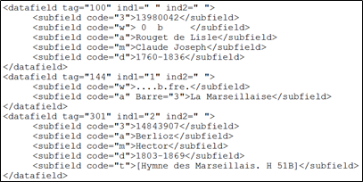
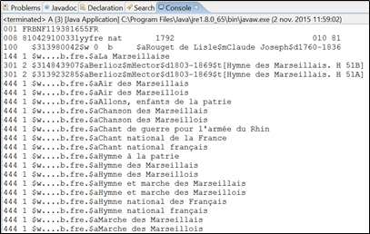
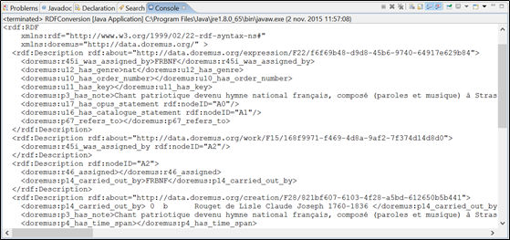

MARC2RDF
========

## About
MARC2RDF is based on the [DOREMUS model][1] that allows a detailed description of a musical work and the events associated with it (creation, execution, etc.). It takes as input INTERMARC-XML and UNIMARC-XML files and generates as output RDF triples. A display in [MARC (MAchine Readable Cataloging)][2] format is an option of our prototype to view an INTERMARC-XML or an UNIMARC-XML file in MARC format.

The [MARCXML][3] format, developed by the Library of Congress in 2001, consists to structure data to MARC in an XML environment. It was founded initially on the [MARC21][4] format, and then it was extended by applying ISO 25577 (MarcXchange), other variants of the MARC (whose INTERMARCXML format used by BNF).

### RDF conversion
The figure, below, illustrates an example an INTERMARC-XML file:

Its display in INTERMARC format:

And its conversion in RDF triples:

## MARC2RDF description:

This tool consists of 4 components:

1. **BNFConverter**: converts INTERMARC-XML records from BNF (Bibliothèque Nationale de France) in RDF triples.
2. **PPConverter**: converts INTERMARC-XML and UNIMARC-XML records from Philharmonie de Paris in RDF triples.
3. **MarcParser**: a parser of INTERMARC-XML and UNIMARC-XML records from BNF and Philarmonie.

The class **Converter** is the "main" class to start converting MARCXML records in RDF triples.

## How to run:

1. Setup the `config.properties` file as you need.
2. Run `gradle run` in the project folder.
3. Display of RDF triples (TBD):
    1. Go to Virtuoso (http: // localhost: 8890)
    2. Click on "Conductor"
    3. Login (“dba”, “dba”)
    4. Click on "Linked Data"
    5. Click on "Graphs"
    6. Click on "DOREMUS" ------> Display of all RDF triples generated from “XMLFile.xml”

### Commands

    gradle run                  ## start conversion of files
    gradle run -Pmarc           ## start conversion of files, with marc as output
    gradle schemagen            ## align ontology package to ontologies in `doremus-ontology` github project

### RDF Store:
Virtuoso 7.2.1 (http://www.openlinksw.com)

[1]: https://drive.google.com/file/d/0B_nxZpGQv9GKZmpKRGl2dmRENGc/view
[2]: https://fr.wikipedia.org/wiki/Machine-Readable_Cataloging
[3]: https://www.loc.gov/standards/marcxml
[4]: https://www.loc.gov/marc
